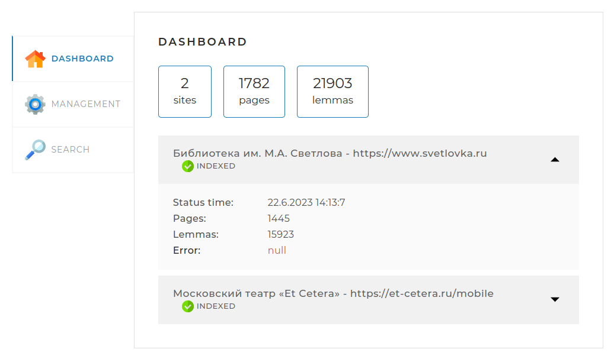

<h1 align="center">PrettySearchEngine</h1>
<h3 align="center">Локальный поисковый движок, позволяющий индексировать веб-сайты</h3>
<div align="center">&nbsp;</div>


### Возможности:
* Парсинг и индексирование страниц веб-сайтов
* Извлечение лемм (lemma, ключ — начальная, словарная форма слова) из проиндексированных веб-страниц
* Подсчёт вхождений найденных лемм
* Сохранение информации о найденных леммах в базе данных MySQL
* Создание сниппетов (фрагментов исходного текста веб-страниц) для последующего их отображения при поиске по базе данных
* Поиск ключей-лемм по базе данных и отображение веб-страниц, в тексте которых встречаются соответствующие им слова в разных формах

### Стек технологий:
* Java 17
* Apache Maven 3.9.2
* Hibernate ORM 6.2
* Spring Boot 2.7.1
* JSOUP 1.15.4
* Lombok 1.18.24
* Apache Lucene 1.5
* MySQL 8.0.33

### Инструкция по развёртыванию приложения:
* Установите Apache Maven
* Установите сервер MySQL
* Создайте базу данных `search_engine`
* Введите веб-адреса и названия сайтов для индексации в следующей секции файла `application.yaml`


* Укажите пользователя и соответствующий ему пароль доступа для соединения с базой данных в этой секции файла `application.yaml`


### Использование приложения:
* Запустите индексацию веб-сайтов
```java
⏵ Run 'Application'
```
* Откройте в веб-браузере страницу http://localhost:8080
* Дождитесь, пока указанные Вами сайты проиндексируются (в зависимости от количества веб-страниц на них, индексация может занять продолжительное время)
* Осуществите поиск ключей-лемм по сформированной в результате индексации базе данных

### Управление приложением:
* Нажатием на кнопку `START INDEXING` запускается индексация веб-сайтов, адреса которых указаны в файле `application.yaml`
* Чтобы остановить индексацию, не дожидаясь её окончания, нажмите на кнопку `STOP INDEXING`
* Кнопкой `ADD/UPDATE` запускается обновление индекса для введённой в поле `Add/update page` страницы веб-сайта (должен быть указан в файле `application.yaml`)

### Скриншоты примеров использования:
* Приложение в процессе индексации


* Индексация веб-страниц завершена





* Поиск вхождений по базе индекса:


